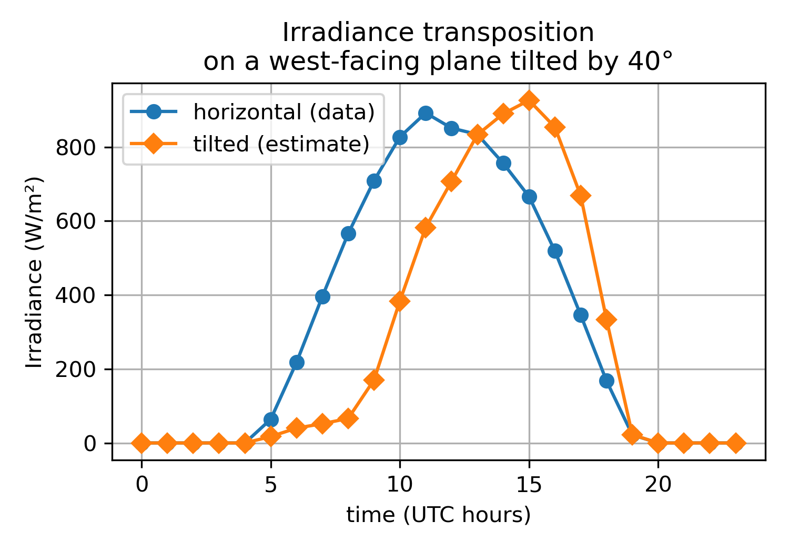
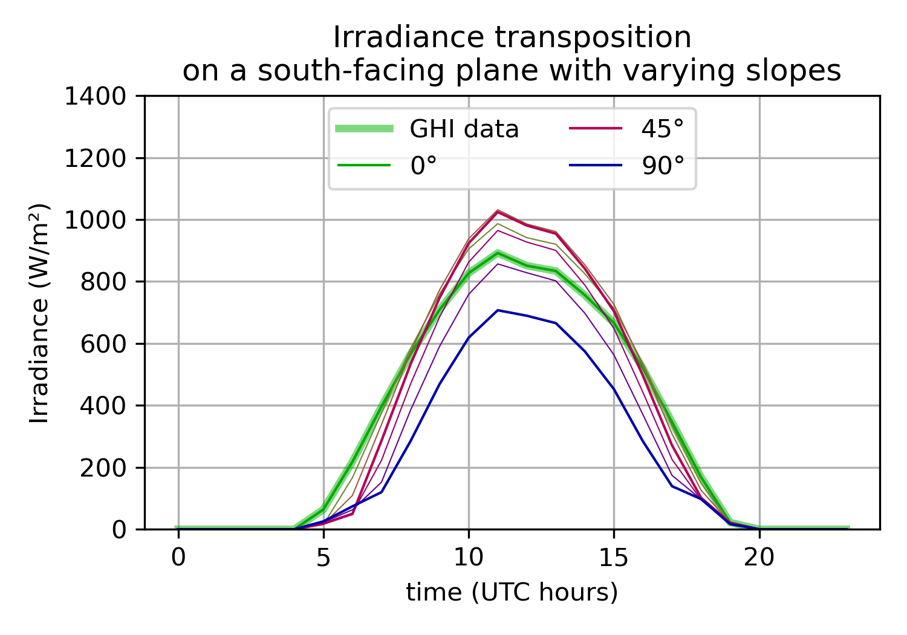

# SolarIrradiance.jl

The SolarIrradiance Julia package implements computations about solar radiation
on the surface of Earth.
Applications include solar energy (solar panels) and building thermal modeling.

In particular, it implements several methods from the literature
to transpose global irradiance data measured on an *horizontal* plane (GHI)
to an irradiance on an *inclined* plane (like a solar panel or the wall of a building).

Authors:

- Pierre Galloo-Beauvais, ENS Rennes
- Pierre Haessig, CentraleSupélec, IETR

This code is made available under a MIT license (see [LICENSE.txt](LICENSE.txt)).

## Usage

### Installation

To install the package, enter the [Pkg REPL](https://pkgdocs.julialang.org/v1/getting-started/)
(pressing `]`) and use the `add` command with the adress of the repository:
```
(@v1.6) pkg> add https://github.com/pierre-haessig/SolarIrradiance.jl
```

Now, it can be used with
```
julia> using SolarIrradiance
```

### Example: Transposing horizontal irradiance data on a tilted plane


Assuming we have the following vector of Global Horizontal Irradiance (GHI) data:
```
julia> GHI_day = [0.0, 0.0, 0.0, 0.0, 0.0, 64.0, 218.0, 396.0, 566.0, 709.0, 827.01, 892.01, 851.01, 834.01, 756.01, 666.0, 519.0, 346.0, 168.0, 21.88, 0.0, 0.0, 0.0, 0.0];
```

We can transform it to an irradiance on an inclined panel with the `global_radiation_tilt` function.
It requires inputs which specify both the GHI measurement to be transposed, the time and location of this measurement, and finally the orientation of the plane for the transposition. These parameters can be set as:

```julia
# Time of the measurement (May 16, 2012)
n = 137 # can be computed with dayofyear(2012, 05, 16)
tc_range = 0:23
dt = 1/60 # 1 minute ~ instantaneous (0.0 is forbidden)

# Location (Rennes, France):
lat = 48.117 #°
lon = -1.678 #°

# Panel orientation:
slope = 40 #°
azimuth = 90 #° → west-facing
albedo = 0.5; # in [0,1]
```

Then, we can transpose each of the 24 values in a loop:

```julia
Gplane = zeros(length(tc_range))

for (k, tck) in enumerate(tc_range)
    GHIk = GHI_day[k]
    Gplane[k] = global_radiation_tilt(GHIk, n, tck, dt, lat, lon, slope, azimuth, albedo)
end
```
The effect of the west orientation is visible: the panel receives more irradiance in the afternon, but much less irradiance in the morning:



Such a radiation transposition model can be used for example to study the effect
of the azimuth and the slope of a solar panel.

Tilting slightly the panel increase cumulated irradiance, but a vertical panel receives less:



East to west azimuth animation:


For a more detailed introduction, see [doc/Usage.ipynb](doc/Usage.ipynb).

## TODOs

- add ability to input to `global_radiation_tilt` the split beam & diffuse irradiance components instead of the GHI 
- implement Muneer 1990 transposition method (e.g. used by PVGIS)
- fix case when `D<=0` in `day_bounds(n, slope, azimuth, lat)` (e.g. north-oriented panel)